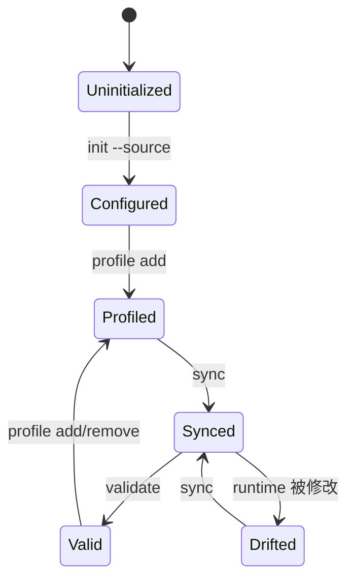

## Context

管理 Skill 是 Agent 的语义控制面，脚本是确定性状态控制面。引擎必须能从公开 source checkout 管理任意项目，同时避免将任务理解、自动批准或路由评分塞进 Shell。

## Goals / Non-Goals

**Goals:**

- Bash 3.2+ 与常见 Unix 工具可运行。
- source、project 和 profile 解耦。
- 未知 runtime 目录不被删除。
- `.agents` 与 `.claude` 的已管理 Skill 内容保持一致。
- 管理 Skill 能指导 Agent 发现、阅读、选择、组合、晋升和验证复杂 Skills。

**Non-Goals:**

- 不下载 Git remote、不管理凭据、不发布 Skill。
- 不实现 marketplace、遥测、HTTP/MCP 服务或后台 daemon。
- 不根据自然语言自动修改 profile。

## Decisions

### 1. 引擎位于管理 Skill 内

`yeisme-skill-routing-governance/scripts/skills.sh` 是 canonical 实现，因此通过通用 Skills 安装器安装该 Skill 时，引擎会随目录一起分发。聚合仓库的顶层脚本只做代理。

### 2. 项目状态分为 portable 与 local

- `.skills/profiles/root.txt`：可提交的激活声明。
- `.skills/source.local`：CLI 生成的服务器本地 source checkout 路径。
- `.skills/managed-runtime.txt`：CLI 生成的已管理 Skill 清单。

### 3. 同步保留未知目录

管理器只重建 profile 中的 Skill，并只移除上一份 managed manifest 中已退出 profile 的目录。其他 Agent 或人工放入 runtime 的目录原样保留。

## Risks / Trade-offs

- [本地 source 目录移动后配置失效] → `doctor` 和所有 source 命令明确失败，并要求重新运行 `configure-source`。
- [递归扫描大型 source 较慢] → 第一版以正确性优先；后续可增加 CLI 生成索引，不在本版引入缓存 schema。
- [已管理 runtime 被人工修改] → `validate` 报告差异，`sync` 以 source/profile 重建。

## Migration Plan

该能力为新增 alpha surface。发布后先由聚合仓库 adapter 使用；现有 Yeisme 根脚本继续独立运行。回滚仅需移除新脚本和文档，不影响已有 profile。
